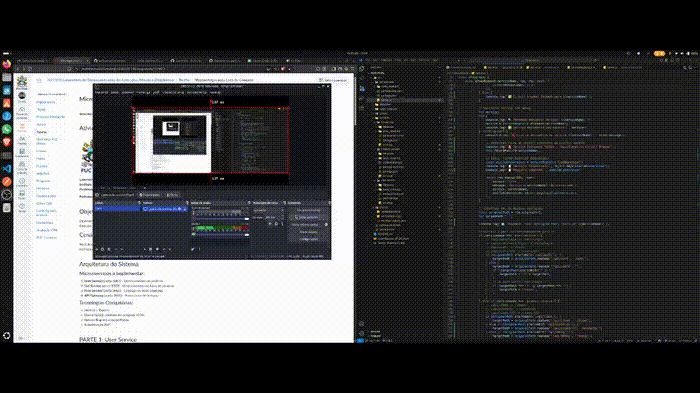

# Sistema de Lista de Compras com Microsserviços

<div align="center">
  
  
</div>

**Laboratório de Desenvolvimento de Aplicações Móveis e Distribuídas**  
**Instituto de Ciências Exatas e Informática (ICEI) - PUC Minas**

---

## 🎬 Demonstração em Vídeo (melhor baixar o mp4 rs)




---

## Descrição

Este projeto implementa um sistema distribuído para gerenciamento de listas de compras, utilizando arquitetura de microsserviços, API Gateway, Service Discovery e bancos NoSQL baseados em arquivos JSON. Desenvolvido como atividade prática para o curso de Sistemas Distribuídos na PUC Minas.

---

## Arquitetura

O sistema é composto por:

- **User Service** (`porta 3001`): Gerenciamento de usuários, autenticação JWT, registro e login.
- **List Service** (`porta 3002`): CRUD de listas de compras, vinculação de itens, resumo de listas.
- **Item/Product Service** (`porta 3003`): Catálogo de itens/produtos, busca, filtros e categorias.
- **API Gateway** (`porta 3000`): Roteamento central, circuit breaker, health checks, dashboard agregado.
- **Service Registry**: Descoberta e registro automático de serviços via arquivo compartilhado.

---

## Tecnologias Utilizadas

- Node.js + Express
- Banco NoSQL (arquivos JSON)
- JWT para autenticação
- Bcrypt para hash de senhas
- Service Discovery via arquivo
- Circuit Breaker simples
- Health checks automáticos

---

## Estrutura de Diretórios

```
src/
├── api-gateway/
├── services/
│   ├── user-service/
│   ├── list-service/
│   └── product-service/
├── shared/
├── database/
├── scripts/
└── client-demo.js
```

---

## Como Executar

### Instalação

```bash
cd src
npm install
npm run install:all
npm run load:all # Carrega dados de exemplo
```

### Execução dos Serviços

Abra 4 terminais e execute:

```bash
# Terminal 1
cd services/user-service && npm start
# Terminal 2
cd services/product-service && npm start
# Terminal 3
cd services/list-service && npm start
# Terminal 4
cd api-gateway && npm start
```

### Teste de Fluxo Completo

```bash
node client-demo.js
```

### Verificações

```bash
curl http://localhost:3000/health
curl http://localhost:3000/registry
```

---

## Endpoints Principais

### User Service
- `POST /auth/register` — Cadastro de usuário
- `POST /auth/login` — Login
- `GET /users/:id` — Buscar usuário
- `PUT /users/:id` — Atualizar perfil

### Item/Product Service
- `GET /items` — Listar itens
- `GET /items/:id` — Buscar item
- `POST /items` — Criar item (autenticado)
- `GET /categories` — Listar categorias
- `GET /search?q=termo` — Buscar itens

### List Service
- `POST /lists` — Criar lista
- `GET /lists` — Listar listas do usuário
- `GET /lists/:id` — Buscar lista
- `PUT /lists/:id` — Atualizar lista
- `DELETE /lists/:id` — Deletar lista
- `POST /lists/:id/items` — Adicionar item à lista
- `GET /lists/:id/summary` — Resumo da lista

### API Gateway
- `/api/auth/*` — User Service
- `/api/items/*` — Item Service
- `/api/lists/*` — List Service
- `/api/dashboard` — Dashboard agregado
- `/api/search?q=termo` — Busca global
- `/health` — Status dos serviços
- `/registry` — Serviços registrados

---

## Service Registry

Implementação baseada em arquivo compartilhado (`shared/serviceRegistry.js`).
- Registro automático de serviços
- Descoberta por nome
- Health checks periódicos
- Cleanup automático

---

## Demonstração de Funcionalidades

O arquivo `client-demo.js` demonstra:
1. Registro de usuário
2. Login
3. Busca de itens
4. Criação de lista
5. Adição de itens à lista
6. Visualização do dashboard

---

## Créditos

Desenvolvido por Arthur Kramberger para PUC Minas — ICEI
Professores: Artur Mol, Cleiton Tavares, Cristiano Neto

---

## Referências

- [Roteiro da Atividade](Tarefa%20-%20Roteiro%2003.md)
- [Documentação Node.js](https://nodejs.org/)
- [Express.js](https://expressjs.com/)
- [JWT](https://jwt.io/)
